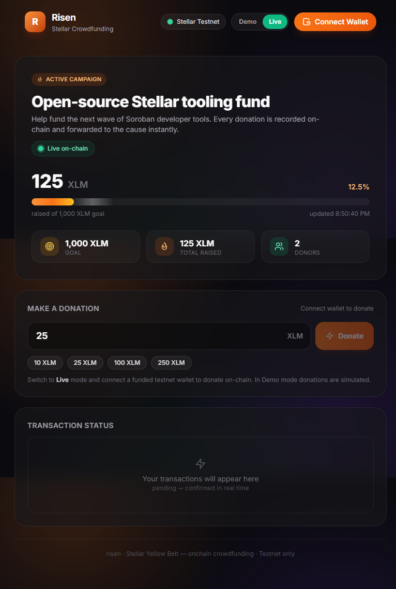
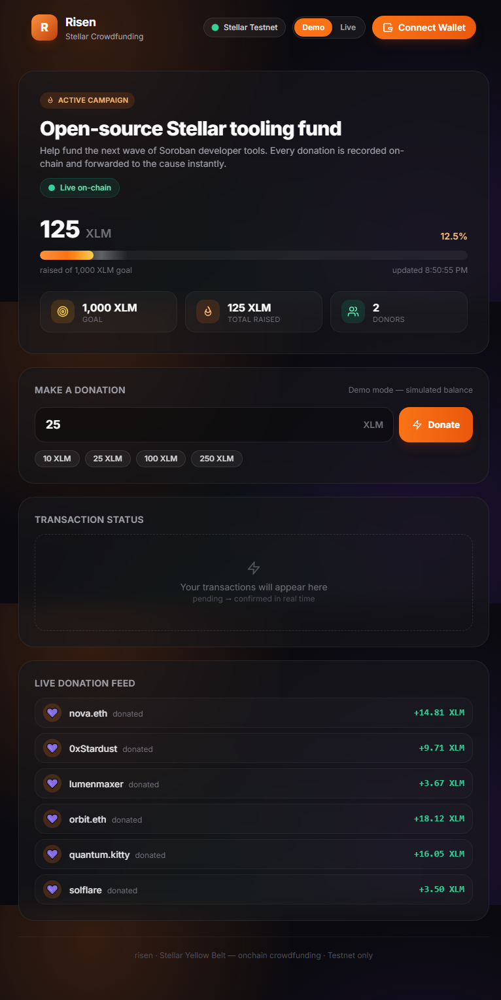
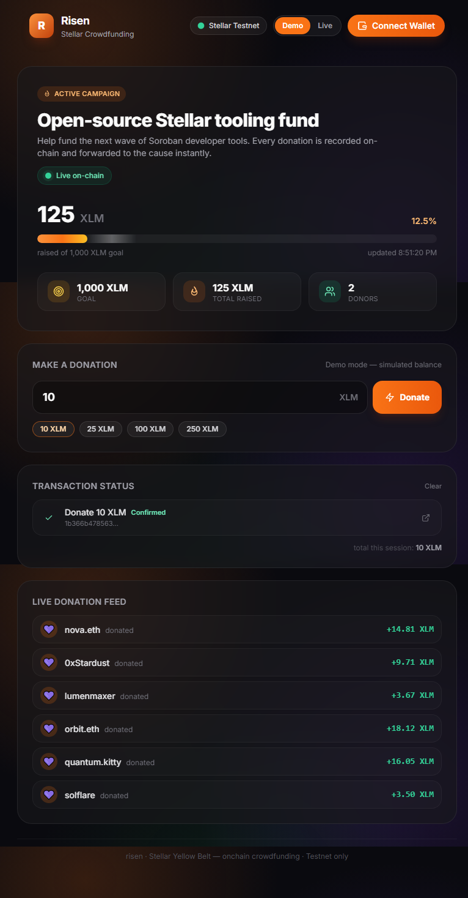
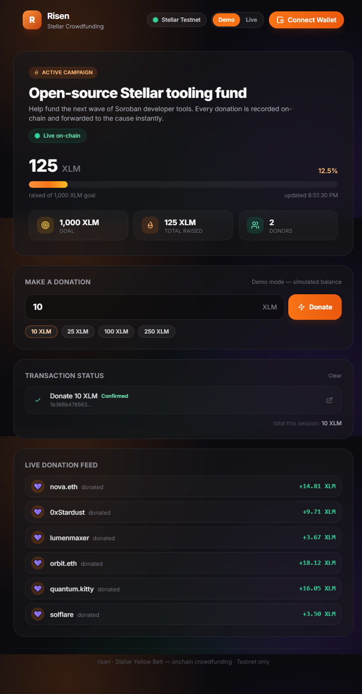
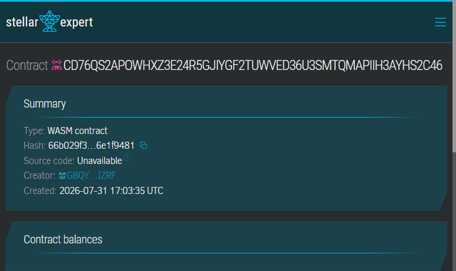

# ✦ risen — Yellow Belt (Level 2)

**A fully on-chain Stellar crowdfunding dApp with a deployed Soroban smart contract, multi-wallet support, real-time donation events, and live transaction status tracking.**


---

Built for the **Stellar Frontend Challenge — Level 2 (Yellow Belt)**. This project goes beyond a simple wallet: it deploys a **Soroban smart contract** that manages a crowdfunding campaign on-chain, and a React frontend that interacts with it in real time.

## 🔗 Live Deployment (Stellar Testnet)

| Item | Value |
| --- | --- |
| **Contract Address** | `CD76QS2APOWHXZ3E24R5GJIYGF2TUWVED36U3SMTQMAPIIH3AYHS2C46` |
| **Explorer** | [stellar.expert](https://stellar.expert/explorer/testnet/contract/CD76QS2APOWHXZ3E24R5GJIYGF2TUWVED36U3SMTQMAPIIH3AYHS2C46) |
| **Campaign Status** | 125 XLM raised of 1,000 XLM goal · 2 donors |

## ▶️ Run Locally

```bash
cd frontend
npm install
npm run dev    # → http://localhost:5176
```

## ✨ Features

- 🔗 **Deployed Soroban contract** — a crowdfunding contract deployed on Stellar Testnet that tracks donations, totals, and donor count
- 📊 **Real-time campaign state** — live progress bar, goal tracking, donor count, and raised amount — all read directly from the contract via Soroban RPC
- 🚀 **On-chain donations** — submit real Soroban transactions: prepare → simulate → sign → submit → poll → confirm
- 📡 **Live donation feed** — real-time event streaming via `server.getEvents()` — see donations as they land on-chain
- 📋 **Transaction status tracking** — full lifecycle: preparing → signing → submitting → pending → confirmed/failed, with explorer links
- 🦊 **Multi-wallet support** — via `@creit.tech/stellar-wallets-kit` (Freighter, Albedo, xBull, etc.)
- 🛡️ **Typed error handling** — categorized errors: wallet_not_found, connection_rejected, insufficient_balance, network, contract
- 🧪 **Demo mode** — full UI preview without a wallet or contract (in-memory simulation)

## 🧱 Tech Stack

| Layer | Tech |
| --- | --- |
| Frontend | React 19, Vite 6, TypeScript 5 |
| Styling | TailwindCSS 3 |
| Wallet | @creit.tech/stellar-wallets-kit 2 |
| Chain | @stellar/stellar-sdk 16 (Soroban RPC) |
| Smart Contract | Soroban (Rust) |

## 📦 Project Structure

```
risen-yellow_200/
├── contract/              # Soroban crowdfunding contract (Rust)
│   ├── src/lib.rs         # Contract logic: initialize, donate, get_state
│   ├── Cargo.toml
│   └── risen_crowdfund.wasm
├── frontend/              # React dApp
│   ├── src/
│   │   ├── components/    # Header, CampaignPanel, DonateForm, TransactionLog, ErrorBanner
│   │   ├── hooks/         # useWallet, useCampaign
│   │   ├── lib/           # contract.ts, wallet.ts, config.ts, demo.ts, types.ts, format.ts
│   │   └── App.tsx
│   ├── package.json
│   └── vite.config.ts
└── screenshots/           # UI walkthrough
```

## 🚀 Getting Started

### Prerequisites
- Node.js 18+
- npm

### Frontend

```bash
cd frontend
npm install
npm run dev          # starts on http://localhost:5181
```

For production:
```bash
npm run build
npm run preview
```

### Smart Contract (already deployed on Testnet)

The contract is deployed at:
```
CD76QS2APOWHXZ3E24R5GJIYGF2TUWVED36U3SMTQMAPIIH3AYHS2C46
```

View on [stellar.expert](https://stellar.expert/explorer/testnet/contract/CD76QS2APOWHXZ3E24R5GJIYGF2TUWVED36U3SMTQMAPIIH3AYHS2C46).

To redeploy:
```bash
cd contract
stellar contract build
stellar contract deploy --wasm target/wasm32-unknown-unknown/release/risen_crowdfund.wasm --network testnet
```

### Demo Mode

Set `VITE_DEMO_MODE=true` in `frontend/.env.local` to run without a wallet. The app simulates all interactions in-memory.

## 🖼️ Screenshots

| # | State | Screenshot |
| --- | --- | --- |
| 1 | Live campaign overview — real on-chain data |  |
| 2 | Donation form — amount selection |  |
| 3 | Transaction confirmed — hash + explorer link |  |
| 4 | Live donation feed — real-time events |  |
| 5 | Deployed contract on Stellar Expert |  |

## 📄 License

MIT © 2026 risen
